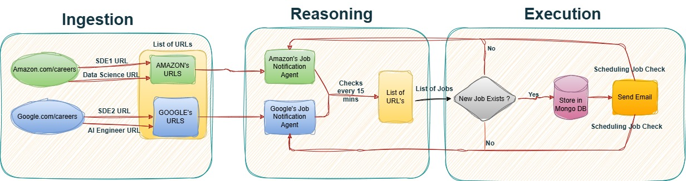

# JobRADAR: Job Notification Agent for the Students by the Students 🚀

## Problem We Are Solving 📢
As students, we have faced significant challenges while searching for jobs. The biggest issue is not receiving interview calls, even after applying to thousands of places. One of the main reasons for this is the overwhelming volume of applications that entry-level jobs receive. Within just a few hours of posting, these jobs can have thousands of applicants, reducing the chances of skilled candidates even passing the initial ATS screening.

To address this, we created **JobRADAR**: A job notification agent that crawls major Big Tech career pages every 15 minutes and sends you an email notification whenever a new job is posted. This way, you can apply immediately before the application pool becomes saturated, improving your chances of getting noticed.

## Features ✨
- **Automated Job Crawling**: Monitors job postings every 15 minutes.
- **Personalized Notifications**: Sends an email with job details, including job ID, position, and link.
- **Customizable Searches**: Allows users to add their own crawlers for desired companies.
- **Open Source & Contributable**: Set up and run locally or contribute to the project!

## Architecture Diagram 🏗️
Below is the architecture diagram illustrating how JobRADDR works:



## How to Set Up JobRADAR Locally 🛠️

### Step 1: Find and Add Your Job URL 🌍
1. Download the project repository.
2. Navigate to `job_crawlers-main/urls/urls.json`.
3. For each company, add an array of job URLs. Example:
   ```json
   "Google": [
       "https://www.google.com/about/careers/applications/jobs/results/?q=product%20manager&location=United%20States&target_level=EARLY&degree=MASTERS&employment_type=FULL_TIME"
   ]
   ```
4. Find job URLs on the career sites of your preferred companies and add them to the JSON file.

### Step 2: Email Setup for Job Notifications 📧
1. Open `job_crawlers-main/email_config/email_setup.py`.
2. Update the following function with your Gmail credentials:
   ```python
   def send_email(job_details_list, receiverEmail=None):
       from_email = "ENTER_YOUR_EMAIL"
       from_password = "ENTER_YOUR_PASSWORD"
       print("In send email function " + receiverEmail)
       to_email = receiverEmail
   ```
3. Set up Google SMTP for secure email sending.

### Step 3 (Optional): Add Your Own Crawlers 🤖
1. Navigate to `job_crawlers-main/crawlers`.
2. Each crawler is designed for a specific company.
3. The crawlers are asynchronous to handle multiple job sites efficiently.
4. Modify or add new crawlers as needed.

### Step 4: Start the Crawler 🚀
1. Open `main.py`.
2. Specify which company you want to track.
3. Run the script to initiate job tracking:
   ```bash
   python main.py
   ```

---

## Setting Up the Project Locally 🏗️

### Prerequisites ✅
- **Node.js & npm** (for frontend)
- **Python & required packages** (for backend)
- **MongoDB** (for storing job data)

### Installation 📦
#### 1. Frontend Setup
```bash
cd job-crawler-frontend
npm install
```

#### 2. Backend Setup
```bash
cd job_crawlers-main
pip install -r requirement.txt
```

### Running the Application ▶️
#### 1. Start the Backend
```bash
python app.py
```

#### 2. Start the Frontend
```bash
cd job-crawler-frontend
npm start
```

Open [http://localhost:3000](http://localhost:3000) to view the application.

---

## Contributing 🤝
We welcome contributions from everyone! Follow these steps:
1. **Fork** the repository.
2. **Create** a new branch for your feature or bug fix.
3. **Commit** your changes.
4. **Submit** a pull request detailing your modifications.

---

## Project Links 🔗
- **Legacy GitHub Repository**: [JobCrawler](https://github.com/DevanshuBrahmbhatt/job_crawlers)
- **Join Our Discord Server**: [Link](https://discord.gg/VCErB2jc)

## Disclaimer ⚠️
This is an **open-source student project** meant for **educational purposes**. We do **not** guarantee any job placements, interviews, or accuracy of job listings. Use this tool at your own discretion. We are not responsible for any errors or issues that arise.

---

## License 📝
This project is licensed under the **MIT License**, meaning you are free to use, modify, and distribute it without restrictions.

```plaintext
MIT License

Copyright (c) 2025 JobRADAR

Permission is hereby granted, free of charge, to any person obtaining a copy
of this software and associated documentation files (the "Software"), to deal
in the Software without restriction, including without limitation the rights
to use, copy, modify, merge, publish, distribute, sublicense, and/or sell
copies of the Software, and to permit persons to whom the Software is
furnished to do so, subject to the following conditions:

THE SOFTWARE IS PROVIDED "AS IS", WITHOUT WARRANTY OF ANY KIND, EXPRESS OR
IMPLIED, INCLUDING BUT NOT LIMITED TO THE WARRANTIES OF MERCHANTABILITY,
FITNESS FOR A PARTICULAR PURPOSE AND NONINFRINGEMENT. IN NO EVENT SHALL THE
AUTHORS OR COPYRIGHT HOLDERS BE LIABLE FOR ANY CLAIM, DAMAGES OR OTHER
LIABILITY, WHETHER IN AN ACTION OF CONTRACT, TORT OR OTHERWISE, ARISING FROM,
OUT OF OR IN CONNECTION WITH THE SOFTWARE OR THE USE OR OTHER DEALINGS IN
THE SOFTWARE.
```

---

🚀 **Happy Job Hunting!** 🎯

